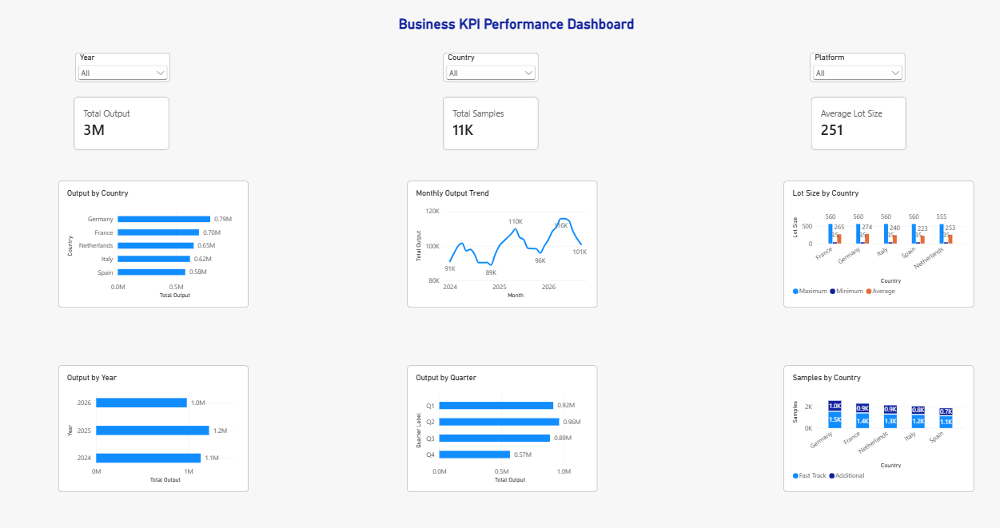

# Business KPI Performance Dashboard

A Power BI portfolio project for analyzing business performance across countries, platforms, and reporting periods.

The dashboard uses a fully synthetic dataset and demonstrates my experience with Excel data preparation, Power Query, DAX, and interactive Power BI reporting.

## Dashboard

## What the Dashboard Analyzes

- Output by country, year, and quarter
- Monthly output trends
- Minimum, average, and maximum lot sizes
- Fast Track and Additional sample volumes
- Performance across different countries and platforms
- KPI summaries for total output, total samples, and average lot size

## Dashboard Features

- Interactive slicers for Year, Country, and Platform
- KPI card visuals
- Bar, line, clustered column, and stacked column charts
- DAX measures for KPI calculations
- Report-page tooltips for additional details
- Monthly, quarterly, and yearly performance comparisons

## Tools Used

- Power BI
- Power Query
- DAX
- Microsoft Excel

## Data

The dataset used in this project is completely synthetic and does not contain confidential or company data.

It contains fictional business KPI data for two platforms across five countries from January 2024 to September 2026.

The 2026 data covers January through September, so 2026 represents a partial year.

## Purpose

I created this project as a portfolio demonstration of the type of KPI reporting and business performance analysis I have worked with professionally.

My previous experience includes preparing Excel-based reporting data, building and maintaining Power BI dashboards, creating DAX calculations, and supporting KPI analysis for management reporting.
